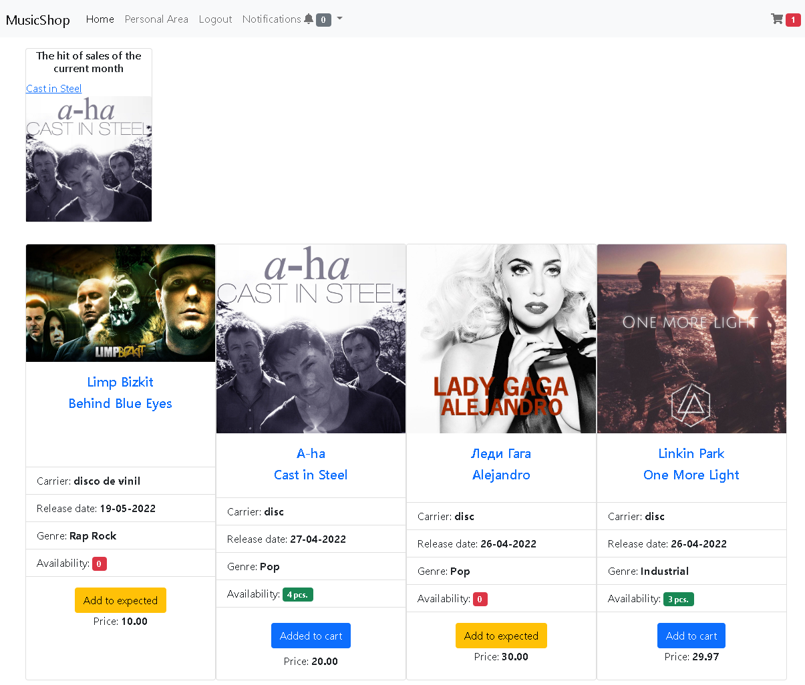

# README #

This README would normally document whatever steps are necessary to get your application up and running.

### What is this repository for? ###
""

image 

image1 

* Quick summary
* Version
* [Learn Markdown](https://bitbucket.org/tutorials/markdowndemo)

### How do I get set up? ###

* Summary of set up
* Configuration
* Dependencies
* Database configuration
* How to run tests
* Deployment instructions

### Contribution guidelines ###

* Writing tests
* Code review
* Other guidelines

### Who do I talk to? ###

* Repo owner or admin
* Other community or team contact